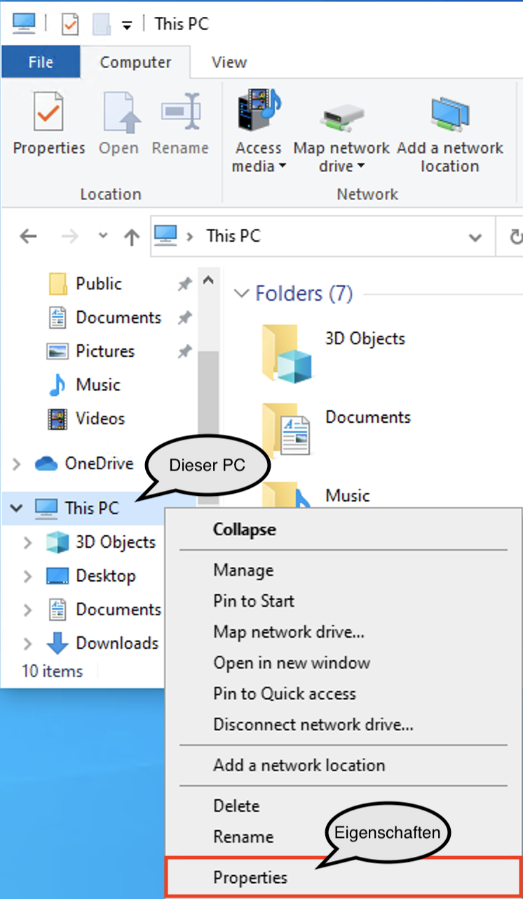
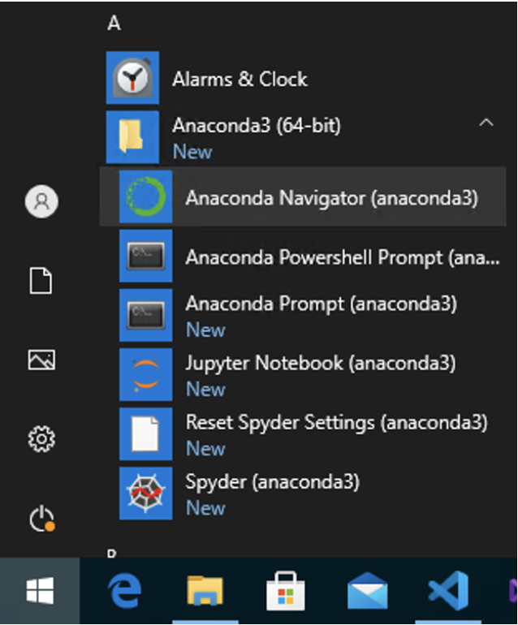
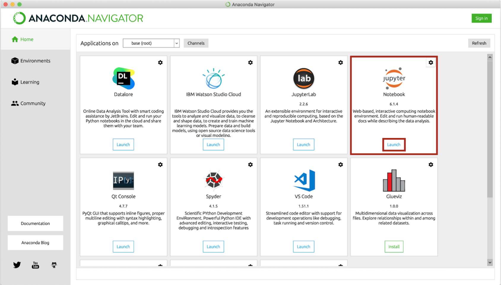
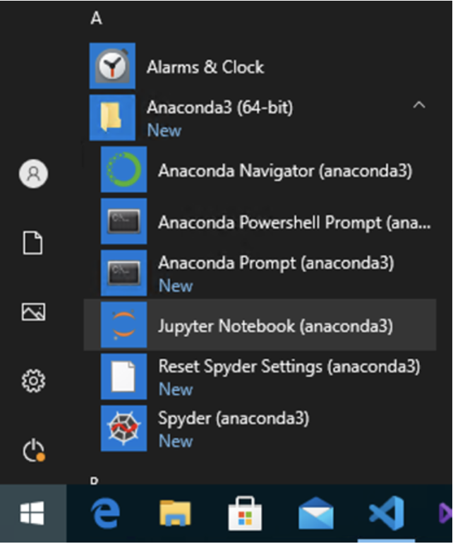
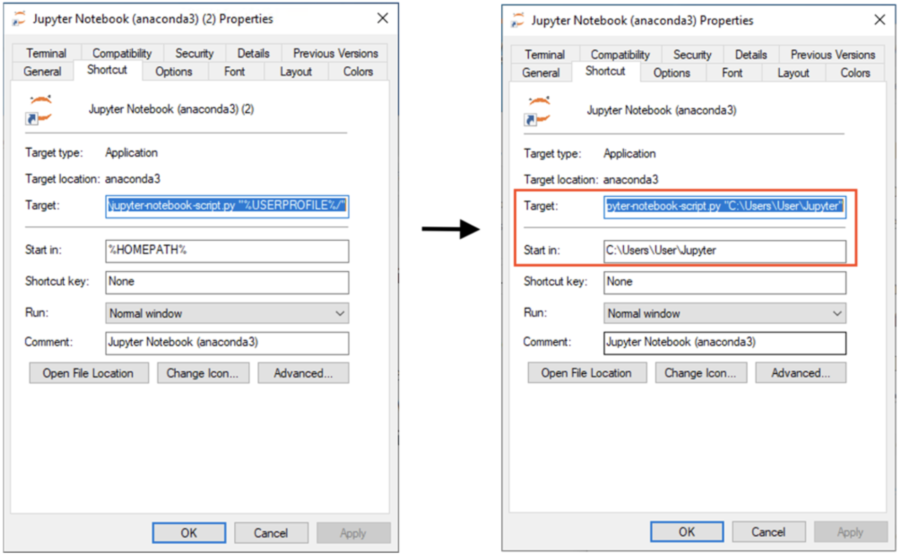

[Startseite](./index.md) | [Lernmaterialien](./mein_material.md) | [Downloads](./downloads.md) | [Inspirationsquellen](./inspiration.md) | Installation Jupyter

# Installation von Anaconda

## Anaconda herunterladen

Gehen Sie auf die Seite von [Anaconda](https://www.anaconda.com/products/individual), um Anaconda herunterzuladen.

* Die Individual-Lizenz ist für den Privat- und Ausbildungsbereich kostenlos.  
  *Sie müssen sich **nirgendwo registrieren***.
* Ein Klick auf den Button &laquo;Download&raquo; unter dem obersten Abschnitt scrollt die Seite an den richtigen Ort.
* Wählen Sie das Download-File, das zu Ihrer Umgebung passt.
  * Für den **Mac** empfiehlt sich der graphische Installer.
  * **Windows**: Wenn Sie nicht sicher sind, ob Sie einen 32-bit- oder 64-bit-Prozessor haben, öffnen Sie ein Explorerfenster, Rechtsklick auf  
  Dieser PC > Eigenschaften > Systemtyp liefert die gewünschte Information:  
   

## Anaconda installieren

Folgen Sie den Instruktionen des Installers.  

* Die entsprechenden Konfigurationen sollten bereits vorangewählt sein:
  * Install for: `Just me / Nur für mich installieren`
  * Destination Folder (Pfad):  
    **Windows**: `C:\users\IhrBenutzername\anaconda3`  
    **-->** Hier werden Sie Ihre Projektdateien ablegen müssen.  
    Falls Sie dies nicht wünschen, installieren Sie anaconda lieber global.
  * Add Anaconda3 to my PATH environment variable
  * Register Anaconda3 as my default Python 3.9: *Kein Haken* ist empfehlenswert, falls Sie noch andere Pythonprojekte mit anderen Tools verwenden.

## Jupyter Notebook öffnen

Es gibt verschiedene Möglichkeiten, wie Sie Jupyter Notebook starten können.

* Am einfachsten starten Sie Jupyter über das Programm *Anaconda Navigator*.
  Öffnen Sie das Programm *Anaconda Navigator*.
  * **Mac**:  
    Sie finden es am einfachsten über die Spotlight-Suche mit [⌘ + Leertaste].
  * **Windows**:  
    Sie finden es über den Startknopf bei den Programmen unter A: Anaconda.  
    
* Im **Anaconda Navigator** finden Sie Jupyter und andere Tools.  
  
  * Starten Sie Jupyter über den Button &laquo;Launch&raquo;.
  * In Ihrem Standard-Web-Browser sollte sich nun Jupyter öffnen.
    * **Windows**: Jupyter Notebook direkt aus dem Start-Menü starten  
      Der Webbrowser wird sich selbst öffnen.  
      

## Möglichkeiten, das Jupyter Notebook im gewünschten Verzeichnis zu öffnen

Sie haben die Möglichkeit, Ihr Jupyter Notebook direkt im Verzeichnis Ihrer Wahl zu öffnen.

* **Mac**:
  * Öffnen Sie das Terminal und gehen Sie direkt *ins Verzeichnis Ihrer Wahl*  
    z. B. `cd ~/schule/informatik/jupyter`
  * Starten Sie das Jupyter Notebook mit dem Befehl  
    `jupyter notebook`
* **Windows**:
  * In diesem Beispiel ist das Verzeichnis: `C:\Users\User\Jupyter`  
    (Benutzername: &laquo;User&laquo;)
  * Machen Sie einen Shortcut des Jupyter Launchers auf den auf dem Desktop.
    * Rechtsklick darauf -> Properties
    * Nun können Sie in den Feldern Target bzw. Start in `%USERPROFILE%` bzw. `%HOMEPATH%` durch Ihren Pfad ersetzen:  
    